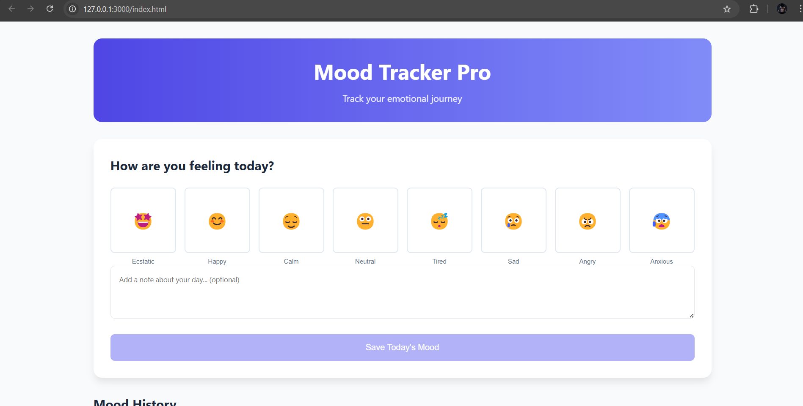
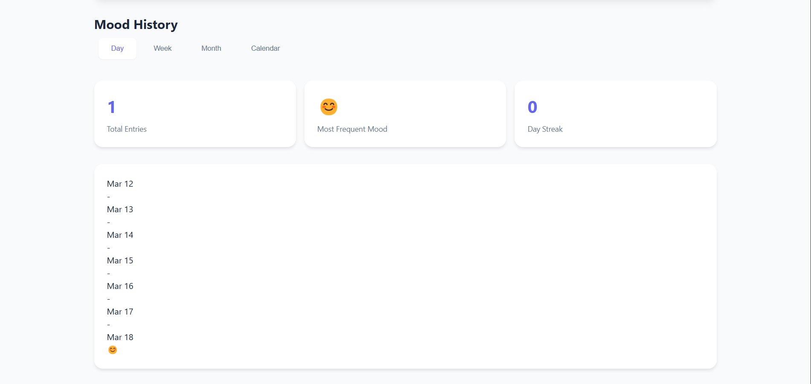

# Mood-Tracker-Pro
 🌟 Mood Tracker – Track Your Daily Moods with Ease! A modern web application that lets users log their daily mood, store data in LocalStorage, and visualize emotional trends over time. The app features a calendar view, past mood history, and a sleek responsive UI for a seamless experience.  🚀 Live Demo: Deployment Link 📜 README & Docs: Includes setup instructions, features, and screenshots. 🛠️ Tech Stack: HTML, CSS, JavaScript  + LocalStorage 👨‍💻 Contributions: Open for enhancements & feature requests!

 🚀 Features
✅ Daily Mood Logging – Users can select an emoji (Happy 😊, Sad 😢, Neutral 😐, Excited 🤩, etc.) to log their daily mood.

✅ Mood History & Insights – The tracker stores all past mood entries in LocalStorage, allowing users to view trends over days, weeks, or months. (Bonus: Calendar View 📅 for easy tracking)

✅ Personal Mood Notes – Users can add optional notes while logging their mood to provide context (e.g., "Had a great day at work!").

✅ Weekly Mood Summary – Automatically calculates and displays the dominant mood of the past 7 days to give insights into emotional patterns.

### 🏠 Home Page  
  

### 📊 Mood History  
  
